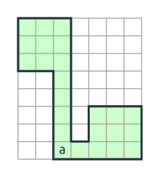
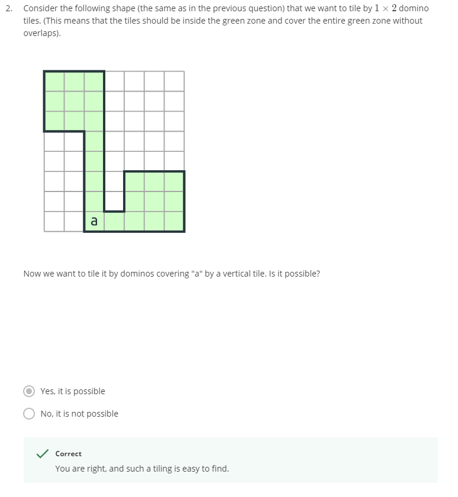
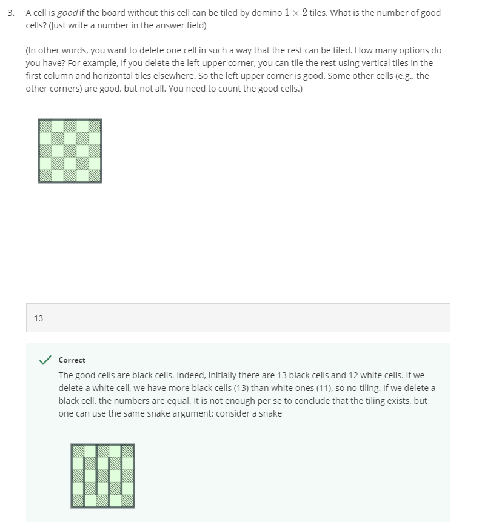

1. Consider the following shape that we want to tile by 1\times 21×2 tiles. (This means that the tiles should be inside 
    the green zone and cover the entire green zone without overlaps)
   
    
   
    Is it possible if we cover the cell "a" by a horizontal tile?

    __Answer__: No
    
2. 

3. 
